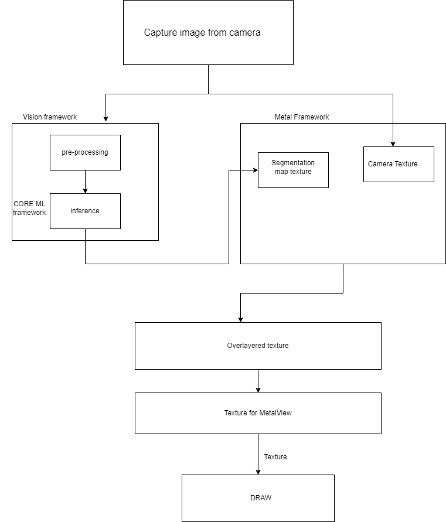
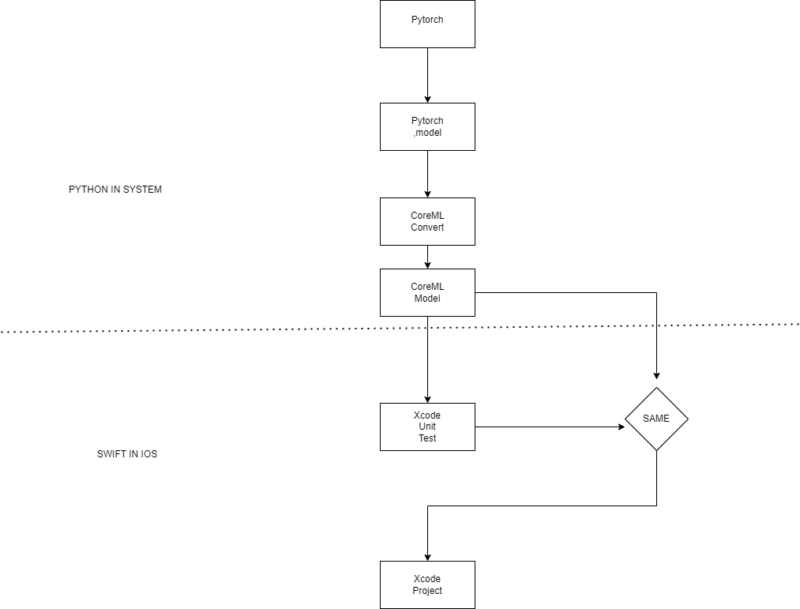

# CCN_PROJECT - Group 6
# Team Members
* Narasimha Naidu Kommi
* Venkata Sai Shalini Ganni
* Siva Naga Rutwik Reddy Chintha
* Prashanth Sammanu

#  Introduction
This project is to utilize Core Machine Learning to perform Object Segmentation with Face Parsing and develop a mobile application, specifically for IOS. To achieve this, we will be utilizing various models throughout the project.
## Implementation Methodology

### 1. DeepLabV3 :
A potent model for object segmentation is DeepLabV3 (https://pytorch.org/hub/pytorch_vision_deeplabv3_resnet101/ ). In object segmentation, each pixel in an image is given a label indicating what object or class it pertains to. It can be used in a wide variety of real-world situations, such as autonomous driving, medical imaging, and picture editing.

We want to use various extensions to DeepLabV3, such as DeepLabV3FP1 is an extension of the original DeepLabV3 architecture. It incorporates a feature pyramid network (FPN) that allows the model to more effectively capture and integrate features at multiple scales.  This allows the model to more effectively integrate features across different scales, which can be important for accurately segmenting objects in images. And we also would like to use DeepLabV3Int8LUT is a variant of the DeepLabV3 image segmentation model that uses an 8-bit integer look-up table (LUT) for efficient inference on low-power devices.

DeepLabV3Int8LUT is particularly well-suited for use on mobile and embedded devices with limited processing power and memory, where it can provide real-time segmentation of images. The model is trained in the same way as the original DeepLabV3 model, but during inference, the pre-computed LUTs are used to speed up the calculations and reduce memory usage.

We want to compare the inferences between different flavours of this model and show the inference and execution time, even on both CPU and GPU. 

### 2. Face Parsing :

Face Parsing is a computer vision technique that involves segmenting a human face into different regions or parts, each corresponding to a different facial feature, such as the eyes, nose, mouth, cheeks, and forehead. This can be useful for a range of applications, including face recognition, facial expression analysis, and virtual makeup and accessories.

Face Parsing typically involves training a deep learning model on a large dataset of labelled images, where each pixel in the image is labeled according to the corresponding facial feature. The model can then be used to predict the facial feature segmentation for new images.

The output of a Face Parsing model is usually a color-coded mask, where each facial feature is represented by a different colour. This can be overlaid on the original image to visualize the segmentation. Face Parsing is a challenging problem due to the large variability in facial appearance across individuals, lighting conditions, and poses, but recent advances in deep learning have led to significant improvements in performance.

### 3. IOS Mobile Application :

Our mobile application project will include a range of features, such as the ability to select images from the device's gallery, as well as capturing live images using the device's camera application. One of the primary features we plan to implement is segmentation parsing.

A computer vision task known as object segmentation entails dividing an image into a number of segments, each of which correlates to a different object or area within the image. Identifying and separating each object in an image from its backdrop is the aim of object segmentation.

We aim to **emphasize real-time recording and inference in our project, to enable users to see the process of the app analyzing and parsing the images in real-time**. Our goal is to demonstrate how the inference process works and how it helps in segmenting and parsing images. And compare them real time. 

# Architecture

## Architecture Diagram:

## Pytorch to CoreML Coversion:

# Project Plan based on two weeks iteration
## Iteration 1
* Gather requirements for the project,Define project scope and objectives. Set up project repository on GitHub and add team members as collaborators
* Familiarize with the technologies and the concepts.
* Divide the project into small parts and assign to each member.
* Set up the environment required to run the model.
* Develop the app interface using Apple's Xcode IDE.
* Implement the interface for the app's camera feature and integrate image capture and storage capabilities. Implement basic image processing functions to convert images to input format required by the segmentation model.

## Status tracker for iteration1 of the Project
### Requirement Analysis and project objectives
####  Requirement Analysis:
* Core Machine Learning: We will be using Core Machine Learning to integrate machine learning models into the IOS application. This will allow us to perform complex tasks such as Object Segmentation with Face Parsing.

* DeepLabV3 Machine Learning Model: DeepLabV3 is a state-of-the-art machine learning model for semantic image segmentation. We will be using this model to identify and label objects within an image.

* iOS Application Development: We will be developing a mobile application specifically for IOS. The application will provide a user-friendly interface that allows users to upload images and receive real-time feedback on object segmentation and face parsing results.

* User Interface: The user interface of the application should be intuitive and easy to use. It should allow users to upload images and perform object segmentation and face parsing without any difficulty.

#### Project Objectives:
* To develop an IOS application that can perform Object Segmentation with Face Parsing using Core Machine Learning.

* To utilize the DeepLabV3 machine learning model to achieve high levels of accuracy in object segmentation tasks.

* To provide a user-friendly interface that allows users to upload images and receive real-time feedback on object segmentation and face parsing results.

* To ensure that the application is intuitive and easy to use for all users.

* To test and validate the application to ensure that it meets the project objectives and requirements.
### Technology Acquitance
As a team, we are excited to share with you the technologies we plan to use in our project, **Object Segmentation with Face Parsing**. Our goal is to develop an iOS application that allows users to upload images and perform object segmentation and face parsing using the DeepLabV3 machine learning model. Here are some key technologies we will be using:

Firstly, we will be using **iOS application development** as our primary platform. This will allow us to create a user-friendly interface using Swift as our programming language and Xcode as our development environment. Swift is a modern programming language that is optimized for performance and safety, and Xcode provides a suite of tools for designing, building, and testing iOS applications.

Secondly, we plan to use Core Machine Learning, to integrate machine learning models into our iOS application. This will enable us to run pre-trained machine learning models on iOS devices, making it possible to perform complex tasks such as object segmentation and face parsing.

Finally, we will be utilizing the **DeepLabV3 machine learning model**. DeepLabV3 is a state-of-the-art machine learning model that is capable of identifying and labeling objects within an image. It has been trained on large datasets of images and can achieve high levels of accuracy in object segmentation tasks. With its ability to handle a wide range of image sizes, DeepLabV3 can be fine-tuned on specific datasets to improve its performance.

By combining these technologies, we hope to create an iOS application that provides users with real-time feedback on object segmentation and face parsing results. Our application has a wide range of applications, including image editing, augmented reality. We are excited to work as a team and utilize these cutting-edge technologies to bring this project to fruition.
### Project Sprint and involvement by each Team member
#### Team Discussion -
For the first iteration, We discussed and learned about the Machine Learning models that we going to use in this project like DeepLabV3 that it allows the model to capture contextual information at multiple scales, which is essential for accurate semantic segmentation. DeepLabv3 is an efficient model for semantic segmentation that is able to give the performance while keeping the computational cost low.
**Venkata Sai Shalini Ganni** started with creating the application User Interface. **Narasimha Naidu Kommi**, **Prashanth Sammanu**, **Siva Naga Rutwik Reddy Chintha** has developed the further controllers in the app such as CustomTextField, DataModel, HomePageViewController, UIButton, CustomTableViewCell. We discussed about the technologies to use in the project and got a clear view of making this application more efficient.

### Starting with IOS App interface
We created an architecture diagram of the project and implemented the interface in Xcode using Swift. We created various buttons and controllers in the swift such as AppDelegate and ContentView.

### Getting the knowledge of the ML Model
DeepLabV3 is a deep neural network architecture that uses a modified version of the convolutional neural network (CNN) called the atrous convolution or dilated convolution. The atrous convolution allows the model to capture multi-scale contextual information while maintaining spatial resolution, which is important for tasks such as image segmentation.

The atrous spatial pyramid pooling (ASPP) module is a key component of the DeepLabV3 architecture. It consists of parallel convolutional layers with different dilation rates, which allows the model to capture multi-scale information. The ASPP module is followed by a decoder network that upsamples the feature maps to the original image resolution.

DeepLabV3 is a powerful and flexible model for image segmentation tasks, including face parsing. Its ability to capture multi-scale contextual information and maintain spatial resolution makes it particularly well-suited for fine-grained segmentation tasks such as face parsing.

## Iteration 2
* Individual assignment Of each Team memeber to be determined
* Perform preliminary testing of the model to assess its precision and pinpoint opportunities for enhancement.
* Modifying the model as required to boost its precision.
* Validating the complete functionality of the model to guarantee that it satisfies the project specifications.
* Add Video capture and support DeepLabV3 model on LiveImageViewController.
* Predict an image imported from our device’s photo library. Configuring Colour range. 
* Adding Inference time in the mobile application. 
## Iteration 3
* Expand the segmentation model.
* CImplement segmentation features for the additional facial features
* IImprove the app's user interface and usability. Add gpu in the mobile application.
* Examine the system's complete operation and, in the event of any problems, troubleshoot and eliminate them to guarantee the application operates seamlessly.

## Status tracker for iteration3 of the Project

## Iteration 4
* Implement real-time video segmentation and integrate it with the camera feature..
* Optimize the app's performance and memory usage. Support face parsing and object segmentation model.
* Adding app tab item and page for tracking face and segmenting it. 
* If issues are found, analyze the root cause and take necessary actions to resolve them.
## Iteration 5
* Get the project documentation ready.
* Construct the presentation and present the completed project.
